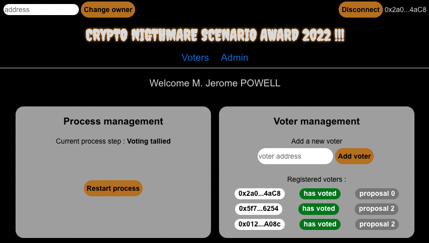

# Alyra, project 3 : DAPPS voting
## Deployed project
contract address on GOERLI : 0x24E28A73a080A66e497C20826887d4BDeadfCFF6

Website : https://alyra-projet3-dapps-voting.vercel.app/

## Demo video
https://www.loom.com/share/b8ff43eadf224192ba87f4c7e0ff3494

## The project
This project is the third project developed for the blockchain developer courses from ALYRA.
The target is to fully develop and deploy a DAPPS, starting from a smart contract provided by ALYRA

## CLI commands
from `` ./truffle/``, ``truffle migrate [option]`` to deploy the contract
from ``./client/``, ``npm start`` to launch the front end

## Technical stack
- Truffle, solc
- React, redux
- SCSS

## screenShot
